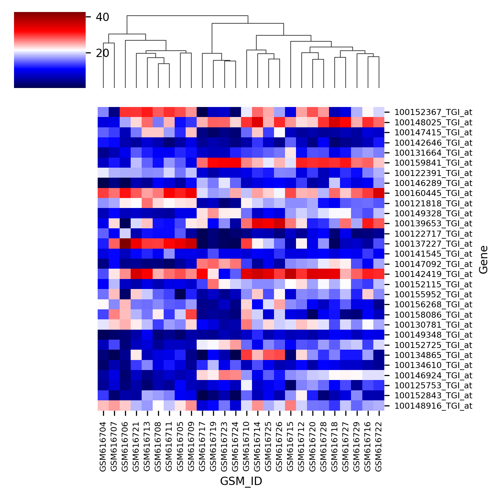
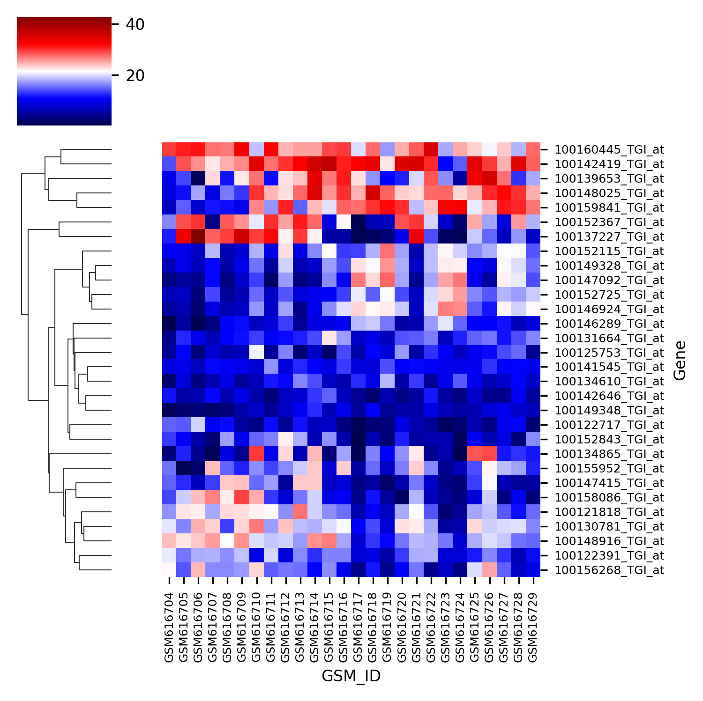

# GeneExpression_analysis  
pip install -r requirements.txt  
NCBI Geo (Gene Expression data) analysis, classification&visualization .

## Classification
By using machine learning models（DecisionTreeClassifier,RandomForestClassifier,SVM,...) from scikit-learn.
  

## Clustering

## Gene Express Level
|||
|---|---|
|||
|||
